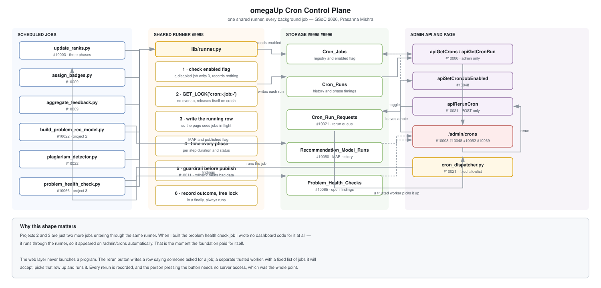
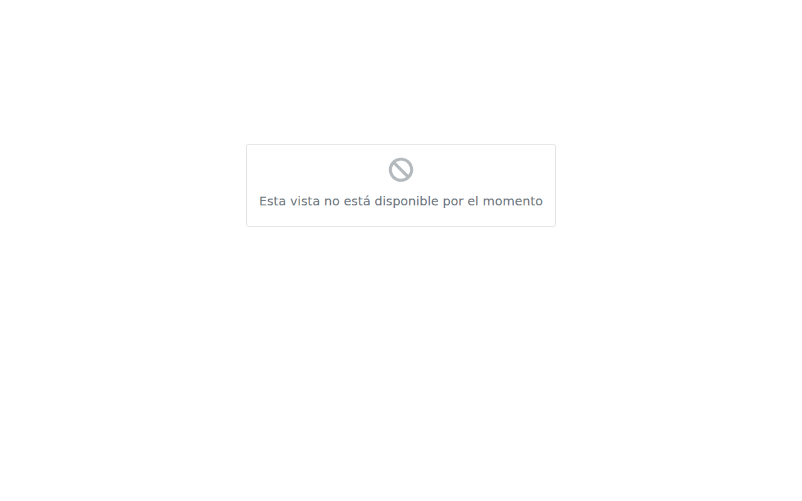
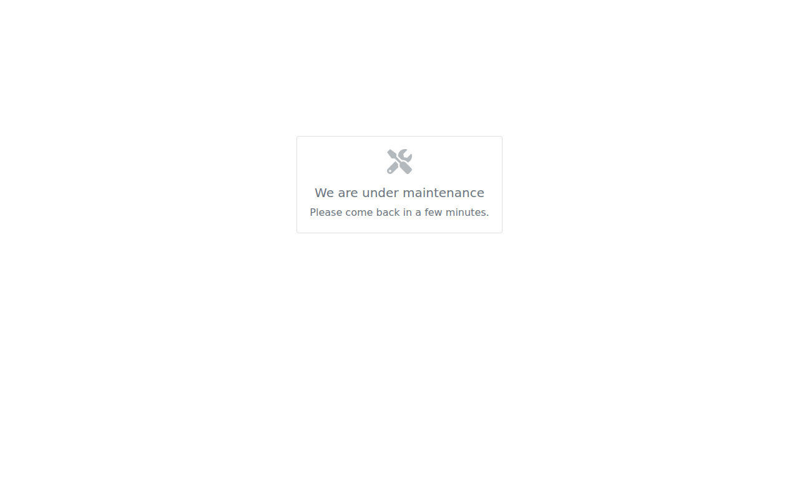
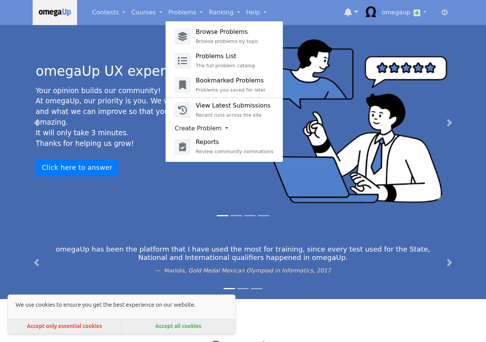
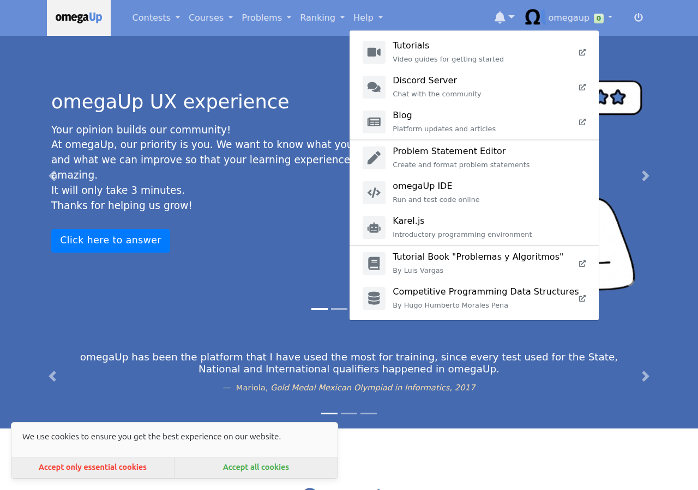
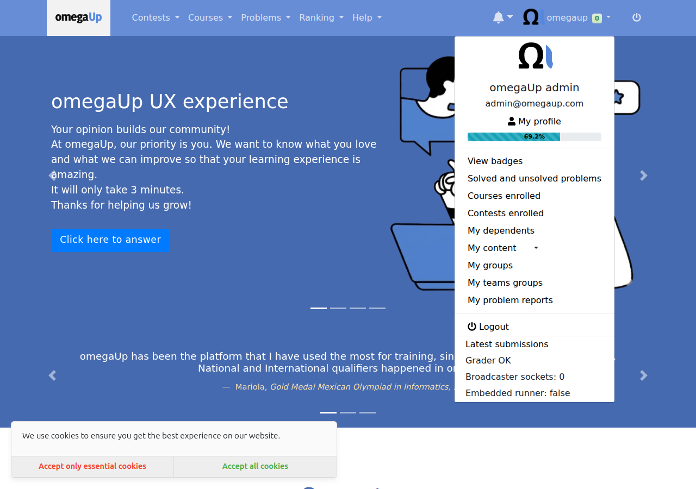

# Google Summer of Code 2026 — omegaUp

## Cronjob Optimization

**Contributor:** Prasanna Mishra ([@PrasannaMishra001](https://github.com/PrasannaMishra001))
**Organisation:** [omegaUp](https://omegaup.com) — a free competitive programming and learning platform used across Latin America
**Mentors:** [@pabo99](https://github.com/pabo99) (Juan Pablo), [@Ankitsinghsisodya](https://github.com/Ankitsinghsisodya) (Ankit)
**Project size:** Large (350 hours)
**Coding period:** 26 May 2026 — 24 August 2026

**Everything in one place:**
[all my pull requests](https://github.com/omegaup/omegaup/pulls?q=is%3Apr+author%3APrasannaMishra001) ·
[all my issues](https://github.com/omegaup/omegaup/issues?q=is%3Aissue+author%3APrasannaMishra001) ·
[the epic that ties the main project together (#9992)](https://github.com/omegaup/omegaup/issues/9992) ·
[the progress tracker discussion (#9972)](https://github.com/omegaup/omegaup/discussions/9972)

---

## Contents

1. [How I got here](#1-how-i-got-here)
2. [The problem, in plain terms](#2-the-problem-in-plain-terms)
3. [What I proposed](#3-what-i-proposed)
4. [What it became, and why](#4-what-it-became-and-why)
5. [Project 1 — the Cron Control Plane](#5-project-1--the-cron-control-plane)
6. [Project 2 — scheduled recommendation model training](#6-project-2--scheduled-recommendation-model-training)
7. [Project 3 — automated problem health checks](#7-project-3--automated-problem-health-checks)
8. [Work outside the cron project](#8-work-outside-the-cron-project)
9. [Every pull request](#9-every-pull-request)
10. [Every issue](#10-every-issue)
11. [How I worked](#11-how-i-worked)
12. [Challenges](#12-challenges)
13. [Where things stand](#13-where-things-stand)
14. [What comes next](#14-what-comes-next)

---

## 1. How I got here

I did not arrive at this project in May. My first pull request to omegaUp was [#8412](https://github.com/omegaup/omegaup/pull/8412) on 31 August 2025, nine months before the coding period began, and by the time GSoC started I had around twenty merged changes on the platform: [GitHub sign-in and the OAuth flow](https://github.com/omegaup/omegaup/pull/8794), [human readable contest dates](https://github.com/omegaup/omegaup/pull/8412), [a reusable 3D badge component](https://github.com/omegaup/omegaup/pull/8846), the [System_Settings table](https://github.com/omegaup/omegaup/pull/8905) and its [DAO layer](https://github.com/omegaup/omegaup/pull/8918), [merging duplicate school profiles](https://github.com/omegaup/omegaup/pull/8874), and a set of smaller fixes.

That matters for one reason. By May I already knew where things lived, how the review culture worked, and who to ask. I did not spend the first month finding my way around, which is why the first deliverable landed four days early and why I could take on a project that turned out to be a lot bigger than the one I proposed.

---

## 2. The problem, in plain terms

omegaUp runs a handful of background jobs on a schedule. They recompute the rankings, hand out badges, aggregate the feedback students leave on problems, and train the model that suggests what to solve next. In production, three of them run once a day at fixed times, and their ordering is enforced by nothing more than the gap on the clock between them.

The thing I kept coming back to is that **nobody was watching**. There was no record that a job had run at all. If last night's ranking job failed, nothing said so, and the first sign would be a student noticing their solve had not counted. Nothing stopped two copies of the same job running at once, which matters because the ranking job used to delete every row of the rankings table and write fresh ones — two copies doing that simultaneously can leave you with half a leaderboard, and no error is raised. And if an admin wanted to re-run a job, the only way was to get shell access to a production pod.

None of that is an exotic failure. It is the ordinary, boring way scheduled work goes wrong, and it is invisible precisely because it is silent.

---

## 3. What I proposed

My proposal was narrow and concrete, and it was mostly about cleaning up four Python scripts. It listed five specific SQL problems (a correlated subquery, the delete-and-reinsert in the ranking job, a triple nested self join, four `NOT IN` admin exclusions, and three places where SQL was built with f-strings), the near total absence of unit tests, fourteen bare `except:` blocks, some magic numbers, badge assignment atomicity, and a `NOW()` string replacement.

The test situation was the starkest part. When I wrote the proposal, `update_ranks.py` had zero Python unit tests, `assign_badges.py` had zero, `aggregate_feedback.py` had one and `build_problem_rec_model.py` had two.

Two honest things happened to that proposal.

**Eight of the items were solved by other contributors** before or during my coding period ([#9420](https://github.com/omegaup/omegaup/pull/9420), [#9862](https://github.com/omegaup/omegaup/pull/9862), [#9502](https://github.com/omegaup/omegaup/pull/9502), [#9236](https://github.com/omegaup/omegaup/pull/9236), [#9286](https://github.com/omegaup/omegaup/pull/9286), [#9166](https://github.com/omegaup/omegaup/pull/9166), [#9525](https://github.com/omegaup/omegaup/pull/9525), and [#9811](https://github.com/omegaup/omegaup/pull/9811)/[#9722](https://github.com/omegaup/omegaup/pull/9722)/[#9744](https://github.com/omegaup/omegaup/pull/9744)). The correlated subquery rewrite I had planned for week four, for instance, was merged by someone else before I got there. I verified each one against main and re-scoped rather than redoing work that was already done, and I tracked the active lanes I needed to stay out of so I would not collide with contributors working on school of the month, incremental feedback aggregation, or the New Relic integration.

**One item turned out to be wrong**, and one turned out not to exist. The shadow table swap I had promised is covered below. And proposal problem 5, duplicate badge notifications, I could not reproduce: the per badge commit and rollback that had landed in [#9236](https://github.com/omegaup/omegaup/pull/9236) already rolls back the badge and its notification together, so the scenario I described does not happen in practice. I recorded that as a finding rather than inventing a fix for it.

---

## 4. What it became, and why

At the midterm I passed, and the feedback was that the work so far did not add up to one thing you could point at. It was a lot of small, individually useful improvements spread across existing scripts, and what was wanted for the second half was something vertical: one project that cuts through the database, the data access layer, the backend, the cron jobs, the interface and the tests, where each piece depends on the one before it and the result is a feature somebody can actually see and use.

I think that was fair. Translated into engineering terms, the first half was horizontal and the second half needed to be vertical. The useful part is that none of the first half was wasted, because a vertical project needs exactly that kind of foundation underneath it.

Rather than pick the next project on my own, I spent a couple of days building a proper case. I read omegaUp's production deployment repository to find out what was actually true rather than what I assumed, and some of it was surprising:

- Only **three** jobs are scheduled in production. `build_problem_rec_model.py` is not among them, which means the recommendation model is never trained in production at all. `plagiarism_detector.py` has never run there either.
- The three that do run are ordered only by clock offsets, so if the ranking job runs long or fails, the jobs after it run against stale data and nothing notices.
- Infrastructure monitoring already exists, so the gap was never raw metrics. The gap was in-product run history, freshness, and admin self service.
- A commit from December 2021 says *"Make update-ranks only run once a day for now"*. The "for now" had lasted five years.

I wrote up fourteen candidate projects and sent them to my mentor with the note that I was not attached to any of them and would rather know what the organisation actually needed. Juan Pablo picked one and named the two that should follow it:

> the highest priority is building a Cron Control Plane. Today our cron infrastructure lacks visibility and operational tooling... After that, automated problem health checks and scheduled training for the recommendation model.

So the second half became three projects that share one foundation. The control plane came first. The other two are each, in the end, just another job plugged into that same foundation, which is the clearest evidence I have that building it was the right call.



<sub>The editable source is in [`diagrams/architecture.drawio`](diagrams/architecture.drawio), openable at [diagrams.net](https://app.diagrams.net).</sub>

---

## 5. Project 1 — the Cron Control Plane

Epic: [#9992](https://github.com/omegaup/omegaup/issues/9992). Twelve pull requests, built as a stack where each one depends on the one below it.

### The pieces

**A registry and a history.** [#9995](https://github.com/omegaup/omegaup/pull/9995) adds two tables. `Cron_Jobs` lists the jobs that exist, with their schedule and an enabled flag. `Cron_Runs` stores one row per execution: when it started and finished, how long it took, whether it succeeded, how many rows it touched, the timing of each step inside it, and the error text if it failed. [#9996](https://github.com/omegaup/omegaup/pull/9996) wraps both in typed data access objects so nothing else writes raw SQL against them.

**A shared runner.** [#9998](https://github.com/omegaup/omegaup/pull/9998) is the keystone. It is one small Python helper that a job wraps its `main()` with:

```python
with lib.runner.run(parser.prog, args) as cron_run:
    with cron_run.phase('update_users_stats'):
        update_users_stats(...)
    cron_run.set_rows_affected(rows)
```

On the way in it opens its own database connection, checks whether the registry says this job is disabled, takes a lock, and writes a row saying the job has started. On the way out it records the outcome, the total duration, the per step timings and any error, then releases the lock.

Two details in there took the most thought.

*Why the lock lives in the database.* These jobs can run on different machines, so a lock file on one machine's disk means nothing to a job on another. The database is the one thing they all share. It also solves the problem I was most worried about: if a job dies while holding the lock, the database ties that lock to the connection, so when the process dies the connection drops and the lock releases by itself. A crash cannot jam the door shut forever, and I did not have to write a line of code for that. Choosing the database as the place gave it to me.

*Why the history stores the job's name rather than its id.* Juan Pablo asked about this in review, and the textbook answer is that I should store the id. Three reasons I did not. The runner writes the "started" row before it ever touches the registry, using the script's own name. Some jobs that use the runner are not in the registry at all, and if the history demanded a registry id those runs either could not be recorded or the runner would start creating registry rows by itself, which turns a curated list into one that fills itself with junk. And this is a history table, so it should survive a job being renamed or removed, with each row keeping the name it actually ran under. He accepted it, with the reasonable condition that the reasoning belongs in the schema rather than in a review thread nobody reads later.

**Adopting it.** [#10003](https://github.com/omegaup/omegaup/pull/10003) puts the ranking job on the runner, and its three stages become three recorded phases. That pull request is a net *smaller* file, because thirty five lines of hand rolled stopwatch logging came out. [#10009](https://github.com/omegaup/omegaup/pull/10009) does badges and feedback aggregation, and adds `mark_failure()` for a specific reason: `assign_badges` used to finish quietly even when an individual badge had failed, so the run needed a way to say "I finished, but something went wrong". [#10022](https://github.com/omegaup/omegaup/pull/10022) finishes the sweep with the recommendation trainer and the plagiarism detector. After that, every background job on the platform records itself.

**A page to look at.** [#10000](https://github.com/omegaup/omegaup/pull/10000) adds two admin only endpoints, [#10008](https://github.com/omegaup/omegaup/pull/10008) puts `/admin/crons` on top of them, and [#10048](https://github.com/omegaup/omegaup/pull/10048) makes it readable: a health card per job with its success rate and average duration, filters, "2 hours ago" style times with the exact timestamp on hover, job names shown as "Update rankings" rather than `update_ranks.py` and schedules as "Every day at 08:19" rather than `19 8 * * *`, with the technical value kept on hover in both cases. It also adds a per job enable and disable switch, which only means anything because the runner checks that flag before it starts.

https://github.com/user-attachments/assets/45588e28-e2d1-4c36-960f-100feff002f5

**A rerun button that does not open a door.** [#10021](https://github.com/omegaup/omegaup/pull/10021) is the one I thought hardest about. The obvious version is that the button sends a request and the server runs the job. I deliberately did not do that. The moment a web page can cause a program to run on your servers you have built a door, and doors get picked.

Instead the button **writes down a request**. A separate trusted worker, already running on the inside, picks that row up and runs the job, and only jobs on a fixed list it knows about. The web page never runs anything, it leaves a note. Two things fall out of that for free: every rerun is recorded, so you can see who asked for what and when, and the person pressing the button needs no server access, which was the entire point. [#10023](https://github.com/omegaup/omegaup/pull/10023) proves the whole path in a real browser.

**A guardrail on the ranking job.** [#10011](https://github.com/omegaup/omegaup/pull/10011) checks the freshly computed ranking before it is published, inside the same transaction. If it is empty, if scores have gone negative, or if more than half the previously ranked users have vanished, it raises and the transaction rolls back.

The framing I keep coming back to is: **I would rather have yesterday's rankings than today's broken ones.**

I proved it rather than asserting it. I ran the real job against a seeded database twice. On the happy path it logs that the audit passed and exits zero. On a forced failure it raises, exits non zero, and the MD5 checksum of the rankings table is identical before and after, which is what "the rollback left the data untouched" actually means.

### The two chains

The work splits into a Python side that writes and a PHP side that reads, and they meet in two places. The enable switch on the page writes `Cron_Jobs.enabled`; the runner reads it before taking the lock. The dashboard renders the per phase JSON that the runner writes. Neither half is complete without the other.

---

## 6. Project 2 — scheduled recommendation model training

Parent issue: [#10049](https://github.com/omegaup/omegaup/issues/10049). Three pull requests: [#10050](https://github.com/omegaup/omegaup/pull/10050), [#10051](https://github.com/omegaup/omegaup/pull/10051), [#10052](https://github.com/omegaup/omegaup/pull/10052).

omegaUp has a model that answers "this student just solved problem X, what should they try next". Before this work it was an on demand script. Nobody was on the hook for running it, there was no record of what any past training had produced, and a bad run would silently overwrite the good model file that was serving real students.

Now each run writes down how good the model it produced was, using a MAP score. That is a single number between zero and one measuring how often the problem the model suggested next turned out to be one the student actually solved, weighted so a good suggestion near the top of the list counts for more. Higher is better. On the dashboard I deliberately put that explanation behind an info icon in those words, because no admin should be expected to know the term.

The guardrail applies two rules before the model file is written. An absolute floor, so a model below a minimum score never ships. And a regression bar against the **last published** model, because the floor on its own only catches disasters, and a model that squeaks over the bar while being clearly worse than the one it is replacing would sail straight through. When either rule fires, the old model file stays exactly where it is, a row is stored with `published = 0` and a readable reason, and the run is marked as a failure so it is visible rather than silent.

Here it is working. One model published at 0.3419, and one refused at 0.2151 with the reason recorded:


I deliberately did not build model versioning and rollback, even though it was the obvious next step. The model file layout and the serving side live in omegaUp's production repository rather than this one, so building it blind risked doing it wrong. I wrote up the question for my mentor instead.

---

## 7. Project 3 — automated problem health checks

Parent issue: [#10064](https://github.com/omegaup/omegaup/issues/10064). Three pull requests: [#10065](https://github.com/omegaup/omegaup/pull/10065), [#10066](https://github.com/omegaup/omegaup/pull/10066), [#10069](https://github.com/omegaup/omegaup/pull/10069).

A problem on omegaUp can stop working after it is published, and nothing errors loudly. Students just hit a wall. Until now the only signal was somebody filing a report, which means the platform found out about broken problems from the people it had already failed.

The job runs nightly and looks for four specific things:

| Check | Severity | What it means |
|---|---|---|
| `judge_errors` | error | Five or more of the recent submissions to one problem came back as a judge or validator error. Students are submitting correct code and getting a system failure. This is the worst one, because to the student it looks like their fault. |
| `no_languages` | error | A public problem with no submission languages enabled. It is listed, browsable, and impossible to submit to. |
| `never_solved` | warning | Public, twenty or more submissions, zero accepted. Either the test data is wrong or the statement is misleading. A warning rather than an error, because a genuinely brutal problem can look like this. |
| `deprecated_public` | warning | Retired but still visible to students. |

How the findings are stored matters as much as the checks. Each finding is upserted against a unique key on the problem and the check type, so it keeps the date it was **first** detected. That is the difference between "this is broken" and "this has been broken for three weeks". Running the job twice produces no duplicates. And a finding that stops appearing is marked resolved rather than deleted, so the history survives. Every threshold is a command line flag, so tuning does not need a code change.

I built it database only, with no access to the problem files. The files sit behind a service that needs signed authentication, and they are already validated when a problem is uploaded. The breakage this job catches happens *after* that, which is exactly what the database knows about. So it needed no new infrastructure.

It also needed no dashboard code of its own. It runs through the shared runner, so it appeared on `/admin/crons` automatically. That is the moment the control plane paid for itself.

---

## 8. Work outside the cron project

The cron project was the main thread, but not the only one. Two other pieces of work ran alongside it and both are merged.

**A generic "view unavailable" component** ([#9919](https://github.com/omegaup/omegaup/pull/9919), issue [#9897](https://github.com/omegaup/omegaup/issues/9897)). omegaUp needed a consistent way to tell a user that a part of the site is switched off, starting with the ephemeral grader. Rather than write that message into the grader, I built one small component the whole platform can use, in every supported language.

| | |
|---|---|
|  |  |

That turned into a follow up. Juan Pablo pointed out that the way I had wired it in would mean copying the same file every time another view needed disabling, so [#10025](https://github.com/omegaup/omegaup/pull/10025) made the entry point generic and driven by the page payload instead.

**Rebuilding the navigation menus from one configuration** ([#9968](https://github.com/omegaup/omegaup/pull/9968), issue [#9966](https://github.com/omegaup/omegaup/issues/9966), building on [#9871](https://github.com/omegaup/omegaup/pull/9871) and [#9801](https://github.com/omegaup/omegaup/pull/9801)). The navbar menus were hand written markup repeated per menu. I extracted a reusable item component with an icon, a title and a description, then rebuilt every menu from a single configuration file with per entry visibility rules, which is the groundwork for showing different entries to different kinds of user.

| | |
|---|---|
|  |  |
|  |  |
|  |  |

There is an honest footnote here. [#9967](https://github.com/omegaup/omegaup/pull/9967) was the earlier version of that change, and I closed it myself: [#9968](https://github.com/omegaup/omegaup/pull/9968) was stacked on top of it and got squash merged first, which carried #9967's content into main and left nothing for it to do.

Two smaller things also merged in this window: [blocking GET on the clone, open and accept endpoints](https://github.com/omegaup/omegaup/pull/9429), which was a security fix, and [returning the contest alias in the clarification create response](https://github.com/omegaup/omegaup/pull/9432).

---

## 9. Every pull request

Thirty one pull requests between 26 May and 3 August. Twelve merged, eighteen open, one closed as redundant.


### Cron Control Plane

| PR | Opened | Status | Change | What it does |
|---|---|---|---|---|
| [#9995](https://github.com/omegaup/omegaup/pull/9995) | 2026-07-13 | merged | +64/-0 in 2 files | add cron control plane tables |
| [#9996](https://github.com/omegaup/omegaup/pull/9996) | 2026-07-13 | merged | +1345/-3 in 9 files | add cron control plane dao |
| [#9998](https://github.com/omegaup/omegaup/pull/9998) | 2026-07-13 | open | +497/-0 in 2 files | add cron runner library |
| [#10000](https://github.com/omegaup/omegaup/pull/10000) | 2026-07-13 | merged | +333/-0 in 6 files | add cron admin api |
| [#10003](https://github.com/omegaup/omegaup/pull/10003) | 2026-07-14 | open | +522/-35 in 3 files | record update ranks runs |
| [#10008](https://github.com/omegaup/omegaup/pull/10008) | 2026-07-14 | open | +548/-0 in 21 files | add cron admin dashboard |
| [#10009](https://github.com/omegaup/omegaup/pull/10009) | 2026-07-14 | open | +545/-89 in 5 files | record badges and feedback runs |
| [#10011](https://github.com/omegaup/omegaup/pull/10011) | 2026-07-15 | open | +580/-35 in 4 files | add ranking audit guardrail |
| [#10021](https://github.com/omegaup/omegaup/pull/10021) | 2026-07-16 | open | +3306/-3 in 41 files | add cron rerun |
| [#10022](https://github.com/omegaup/omegaup/pull/10022) | 2026-07-16 | open | +602/-132 in 7 files | record remaining cron runs |
| [#10023](https://github.com/omegaup/omegaup/pull/10023) | 2026-07-16 | open | +3336/-3 in 42 files | add cron dashboard e2e |
| [#10048](https://github.com/omegaup/omegaup/pull/10048) | 2026-07-26 | open | +4438/-3 in 43 files | improve cron dashboard with health cards filters and auto refresh |

### Cron tests, queries and reliability

| PR | Opened | Status | Change | What it does |
|---|---|---|---|---|
| [#9883](https://github.com/omegaup/omegaup/pull/9883) | 2026-06-02 | open | +542/-0 in 8 files | feat(cron): add unit test infrastructure and aggregate_feedback/utils tests |
| [#9889](https://github.com/omegaup/omegaup/pull/9889) | 2026-06-07 | open | +942/-23 in 11 files | feat(cron): add update_ranks unit tests |
| [#9900](https://github.com/omegaup/omegaup/pull/9900) | 2026-06-12 | merged | +22/-30 in 2 files | fix(cron): parameterize coder_of_the_month queries |
| [#9901](https://github.com/omegaup/omegaup/pull/9901) | 2026-06-12 | merged | +16/-16 in 5 files | fix(cron): replace bare except clauses with typed except |
| [#9903](https://github.com/omegaup/omegaup/pull/9903) | 2026-06-12 | merged | +38/-2 in 1 files | fix(cron): merge user rank with upsert instead of full reinsert |
| [#9914](https://github.com/omegaup/omegaup/pull/9914) | 2026-06-19 | open | +203/-80 in 6 files | add structured phase logging to crons |
| [#9920](https://github.com/omegaup/omegaup/pull/9920) | 2026-06-21 | open | +1146/-23 in 12 files | feat(cron): add assign_badges unit tests |
| [#9940](https://github.com/omegaup/omegaup/pull/9940) | 2026-06-26 | merged | +29/-15 in 3 files | refactor(cron): name acl/role magic numbers with constants |

### Recommendation model training

| PR | Opened | Status | Change | What it does |
|---|---|---|---|---|
| [#10050](https://github.com/omegaup/omegaup/pull/10050) | 2026-07-27 | open | +3957/-133 in 49 files | add recommendation model runs table |
| [#10051](https://github.com/omegaup/omegaup/pull/10051) | 2026-07-27 | open | +4314/-134 in 51 files | record and guard recommendation training |
| [#10052](https://github.com/omegaup/omegaup/pull/10052) | 2026-07-27 | open | +4908/-133 in 53 files | add recommendation model dao and dashboard |

### Problem health checks

| PR | Opened | Status | Change | What it does |
|---|---|---|---|---|
| [#10065](https://github.com/omegaup/omegaup/pull/10065) | 2026-07-31 | merged | +34/-0 in 2 files | add problem health checks table |
| [#10066](https://github.com/omegaup/omegaup/pull/10066) | 2026-08-01 | open | +4394/-133 in 51 files | add problem health check cron |
| [#10069](https://github.com/omegaup/omegaup/pull/10069) | 2026-08-03 | open | +5157/-133 in 54 files | show problem health findings for admins |

### Other work in this period

| PR | Opened | Status | Change | What it does |
|---|---|---|---|---|
| [#9871](https://github.com/omegaup/omegaup/pull/9871) | 2026-05-26 | merged | +352/-150 in 4 files | Extract NavbarItem component for help menu |
| [#9919](https://github.com/omegaup/omegaup/pull/9919) | 2026-06-21 | merged | +142/-0 in 15 files | add view unavailable component |
| [#9967](https://github.com/omegaup/omegaup/pull/9967) | 2026-07-04 | closed | +368/-67 in 14 files | extend navbar item style to remaining submenus |
| [#9968](https://github.com/omegaup/omegaup/pull/9968) | 2026-07-04 | merged | +676/-233 in 20 files | build navbar menus from a single configuration |
| [#10025](https://github.com/omegaup/omegaup/pull/10025) | 2026-07-16 | merged | +25/-6 in 4 files | make view unavailable entrypoint generic |

> **On the file counts.** The cron control plane pull requests are stacked, each built on
> the one before it, so GitHub's diff for a later one still carries its unmerged
> predecessors. [#10069](https://github.com/omegaup/omegaup/pull/10069) shows 54 files but
> adds three of its own. Each shrinks to just its own change once the one below it merges,
> which is how the ones that have already merged got down to two and six files.


---

## 10. Every issue

Thirty issues, each one written before the pull request that closes it. The three parent issues are marked.

| Issue | Opened | Status | Title |
|---|---|---|---|
| [#9868](https://github.com/omegaup/omegaup/issues/9868) | 2026-05-26 | closed | As a developer, I want a reusable NavbarItem component so that submenu entries are easier to maintain |
| [#9869](https://github.com/omegaup/omegaup/issues/9869) | 2026-05-26 | closed | As a contributor, I want editable fields in the feature request form so that I can fill in the As a / I want / so that prompts directly |
| [#9870](https://github.com/omegaup/omegaup/issues/9870) | 2026-05-26 | closed | Refactor navbar help submenu into a reusable NavbarItem component |
| [#9882](https://github.com/omegaup/omegaup/issues/9882) | 2026-06-02 | open | Add unit test infrastructure for cron scripts |
| [#9888](https://github.com/omegaup/omegaup/issues/9888) | 2026-06-07 | open | Add unit tests for update_ranks.py ranking logic |
| [#9890](https://github.com/omegaup/omegaup/issues/9890) | 2026-06-07 | open | Add unit tests for assign_badges.py |
| [#9897](https://github.com/omegaup/omegaup/issues/9897) | 2026-06-11 | closed | Add a generic "View unavailable" component |
| [#9899](https://github.com/omegaup/omegaup/issues/9899) | 2026-06-12 | closed | Parameterize string-built queries in coder_of_the_month.py |
| [#9902](https://github.com/omegaup/omegaup/issues/9902) | 2026-06-12 | closed | Avoid full delete and reinsert of User_Rank in update_ranks |
| [#9904](https://github.com/omegaup/omegaup/issues/9904) | 2026-06-12 | open | Prevent and merge duplicate school profiles |
| [#9913](https://github.com/omegaup/omegaup/issues/9913) | 2026-06-19 | open | Emit structured per-phase logs from cron scripts |
| [#9939](https://github.com/omegaup/omegaup/issues/9939) | 2026-06-26 | closed | Replace acl_id/role_id magic numbers in cron scripts with named constants |
| [#9962](https://github.com/omegaup/omegaup/issues/9962) | 2026-07-03 | open | Extend the navbar item style with icons and descriptions to remaining submenus |
| [#9966](https://github.com/omegaup/omegaup/issues/9966) | 2026-07-04 | closed | Build the navbar menus from a single configuration with visibility rules |
| [#9992](https://github.com/omegaup/omegaup/issues/9992) | 2026-07-13 | open | Cron Control Plane : an observability and operational tooling for background jobs **(parent)** |
| [#9993](https://github.com/omegaup/omegaup/issues/9993) | 2026-07-13 | closed | persistant cron execution history by registry and run tables |
| [#9994](https://github.com/omegaup/omegaup/issues/9994) | 2026-07-13 | closed | DAOs for the cron tables |
| [#9997](https://github.com/omegaup/omegaup/issues/9997) | 2026-07-13 | open | Reusable cron runner that records runs and prevents overlap |
| [#9999](https://github.com/omegaup/omegaup/issues/9999) | 2026-07-13 | closed | Admin API for cron run history and health |
| [#10002](https://github.com/omegaup/omegaup/issues/10002) | 2026-07-14 | open | Record update_ranks executions through the runner |
| [#10004](https://github.com/omegaup/omegaup/issues/10004) | 2026-07-14 | open | Admin dashboard page for cron jobs |
| [#10007](https://github.com/omegaup/omegaup/issues/10007) | 2026-07-14 | open | Record assign_badges and aggregate_feedback through the runner |
| [#10010](https://github.com/omegaup/omegaup/issues/10010) | 2026-07-15 | open | Pre-publish guardrail for the ranking job |
| [#10017](https://github.com/omegaup/omegaup/issues/10017) | 2026-07-16 | closed | Make the view unavailable entrypoint generic and driven by the payload |
| [#10018](https://github.com/omegaup/omegaup/issues/10018) | 2026-07-16 | open | Let admins safely rerun a cron job |
| [#10019](https://github.com/omegaup/omegaup/issues/10019) | 2026-07-16 | open | Record the remaining crons through the runner |
| [#10020](https://github.com/omegaup/omegaup/issues/10020) | 2026-07-16 | open | End to end test for the cron dashboard |
| [#10047](https://github.com/omegaup/omegaup/issues/10047) | 2026-07-26 | open | Improve the cron dashboard with health cards, filters, relative times and auto refresh |
| [#10049](https://github.com/omegaup/omegaup/issues/10049) | 2026-07-26 | open | Make the recommendation model training scheduled, recorded and guarded **(parent)** |
| [#10064](https://github.com/omegaup/omegaup/issues/10064) | 2026-07-31 | open | Detect problems that silently stopped working **(parent)** |

---

## 11. How I worked

**Tests before the thing that needs them.** The cron scripts had no test infrastructure at all when I started. Not thin coverage, none. There was a good reason it had been skipped: these scripts talk straight to the database, so every function expects a live MySQL connection, and testing "does the ranking logic compute the right order" meant standing up a database with the right data in it first. Slow, awkward, breaks on other people's machines. So it never got done.

I built a fake database instead ([#9883](https://github.com/omegaup/omegaup/pull/9883)) — a `MockCursor` and `MockConnection` that behave enough like the real thing that the existing cron code runs against them unchanged. Only then could the ranking and badge logic be tested ([#9889](https://github.com/omegaup/omegaup/pull/9889), [#9920](https://github.com/omegaup/omegaup/pull/9920)).

This is the part I would defend hardest if someone called it box ticking. Look at what I built later: a button that reruns jobs, and a guardrail that decides whether data goes live. Both are only safe if one property holds, which is that **running a job twice leaves things exactly as running it once did**. If that is true, a rerun is harmless and the button is a feature. If it is not, the button is a way to corrupt production data with one click and I should not have built it. The chain is: no fake database, no tests, no proof, and the rerun button is irresponsible.

**Small stacked pull requests, opened one at a time.** After Juan Pablo told me one of my pull requests was doing too much:

> How about splitting this into multiple PRs? The first could include all the database schema changes... that would make things much easier to review.

I restructured everything into a stack. Tables, then the code that reads them, then the API, then the page, each depending on the one before, each small enough to review in one sitting. I also learned to keep the later ones as drafts until their predecessor merges, so nobody opens a pull request full of code they already reviewed. That habit came from getting it wrong once: a stacked pull request got squash merged out of order, which dragged its dependency into main and made that dependency redundant.

The lesson I actually took: **reviewer time is the scarcest resource on the project**, and optimising my work for my convenience against their attention is a bad trade.

**Answering reviews properly.** Ankit left thirteen inline comments on the test infrastructure. Several were real bugs in the fake database itself. `fetchone()` did not advance, so it returned the first row forever and any test looping over results would have passed while testing nothing. SQL matching was case sensitive in one direction. The `dictionary` argument was accepted and thrown away. That review taught me the thing I keep repeating to myself: **a fake that is subtly wrong is worse than no fake**, because the tests built on it pass for the wrong reason.

One of the flagged bugs I checked and pushed back on, politely, after tracing it to the real caller and finding it unreachable behind a guard. I documented it as latent rather than patching something that could not happen.

**Research before committing to a design.** The clearest case is below.

---

## 12. Challenges

**The shadow table swap I promised in my proposal was wrong.** My proposal committed to rebuilding the rankings in a second table and swapping it in with `RENAME TABLE`. When I actually researched it in June, I found five problems. `RENAME TABLE` is DDL, so it forces an implicit commit and breaks the single transaction the phase relies on. `CREATE TABLE ... LIKE` does not copy foreign key constraints, and the names are database unique, so the swapped table either silently loses three constraints or needs alternating names. It needs privileges the production database user may not have, and I could not verify that. It changes what the coder of the month calculation sees mid run. And it still rewrites every row every day, so the churn is not reduced, it is relocated.

Worse, the problem it was meant to solve had already been fixed by someone else. The phase had become a single transaction, and MySQL's MVCC means readers already see the complete old ranking throughout. The "users see an empty leaderboard" scenario I had written the proposal against no longer existed.

So I killed my own proposal item and replaced it with an upsert ([#9903](https://github.com/omegaup/omegaup/pull/9903)) that stays inside the transaction, needs no privileges, keeps the foreign keys, and follows a pattern already used elsewhere in the same file. I would rather have that conversation than deliver the thing I promised and have it be wrong.

**Two required checks that wanted opposite things.** After the tables merged, the next pull request started failing in a way I could not resolve. One check demanded a generated schema file be byte identical to the main schema. Another check crashed trying to read that same file. Both were required, so satisfying one broke the other.

The crash turned out to be at one specific table, caused by a full text index clause another contributor had recently added that the schema parser did not understand. Nobody had hit it before because main's copy of the generated file was simply out of date and did not contain that line yet. Mine was the first change to regenerate it, so I was the first to stand on a landmine that had been sitting there. The fix was one line in the parser, and I verified it by regenerating everything and confirming the output was byte identical, so the change only relaxes reading and cannot alter what gets generated.

What I took from it: **when two automated checks disagree, the disagreement is usually pointing at something real.**

**A bug that only writing the test revealed.** In the health checks, the step that closes resolved findings was reading the clock *after* writing the new ones. On a slow run, a finding written moments earlier could be judged "not seen this run" and closed immediately, so the job would report a problem as fixed the instant it found it. The fix was to take one timestamp for the whole run. This is the strongest argument for tests I have from this project, because the bug was in code I had just written and believed was correct.

**"No results" and "not working" look identical from the outside.** Three of the four health checks fired on the first real run. The judge errors check found nothing, and my first reaction was "good, no broken judges". That was wrong. It found nothing because the development database contained no runs with that kind of error at all, so the check had never actually been exercised. I was about to ship a check I had never seen work. I seeded the failure case and watched it fire before I trusted it.

**The bookkeeping cost of stacking.** Keeping the pieces small and ordered is right for reviewers and expensive for me. Every time something merges I rebase the next one so its diff stands alone. When the tables merged the migration was renumbered, so every later database change had to shift too. At one point a change to a shared file had to be propagated across **seventeen branches** because they all descended from it. I still think the trade is correct, since the alternative is unreviewable pull requests, but I underestimated the admin.

**Nothing merged for the first five weeks.** At the midterm, zero of my cron project pull requests had been merged. Everything had green CI and was waiting. That was uncomfortable and it was not something I could fix by writing more code. My mentors were clear that review bandwidth was the constraint and told me to keep building. The first one landed on 3 July, and eleven more have landed since.

---

## 13. Where things stand

Honestly, because a report that only lists what landed is not much use to anyone.

**Merged.** Seventeen of my pull requests merged during the coding period, twelve of them raised inside it and five raised just before it and finished during. On the cron project specifically, the whole foundation is now on main: the [registry and history tables](https://github.com/omegaup/omegaup/pull/9995), the [data access layer](https://github.com/omegaup/omegaup/pull/9996), the [admin API](https://github.com/omegaup/omegaup/pull/10000), the [problem health checks table](https://github.com/omegaup/omegaup/pull/10065), the [ranking upsert](https://github.com/omegaup/omegaup/pull/9903), the [SQL parameterisation](https://github.com/omegaup/omegaup/pull/9900), the [typed exception handling](https://github.com/omegaup/omegaup/pull/9901) and the [acl and role constants](https://github.com/omegaup/omegaup/pull/9940).

**In review, green, and waiting.** [#9998](https://github.com/omegaup/omegaup/pull/9998), the shared runner, is approved. It is also the keystone: four more pull requests sit directly behind it. [#10003](https://github.com/omegaup/omegaup/pull/10003), [#10008](https://github.com/omegaup/omegaup/pull/10008), [#9883](https://github.com/omegaup/omegaup/pull/9883), [#9889](https://github.com/omegaup/omegaup/pull/9889), [#9920](https://github.com/omegaup/omegaup/pull/9920) and [#9914](https://github.com/omegaup/omegaup/pull/9914) are all mergeable with passing checks.

**Built, tested and waiting for their turn.** Eleven more are open as drafts, kept that way on purpose so they surface one at a time as the pull request below each of them merges. Every one of them has been run locally and verified end to end in Docker.

**One closed.** [#9967](https://github.com/omegaup/omegaup/pull/9967) I closed myself, because its content had already reached main through [#9968](https://github.com/omegaup/omegaup/pull/9968), which was stacked on top of it and got squash merged first. Nothing was lost, but it is the clearest example of the ordering problem I described above.

What sets the pace at this point is review time rather than code. I do not say that as a complaint, it is a real constraint on a volunteer maintained project and my mentors have been straight with me about it. Nothing is half built, and nothing is blocked on me.

---

## 14. What comes next

Things I would pick up next, in the order I would do them.

**Missed run detection.** The gap I care most about. The system can now tell you a job failed, but not that a job never started. That is the one failure mode run history structurally cannot catch, and it is what every cron monitoring product leads with. The schedule is already stored in the registry, so the pieces are there.

**Failure alerting.** Notify admins when a run records a failure, reusing the notification path the rerun dispatcher already uses. This is the piece that turns history into monitoring.

**Retention.** Nothing deletes from the run history. That is fine today and will not be in two years.

**Smaller things.** Pagination past the fifty run cap, a duration sparkline per job to spot slowdowns as a shape rather than a number, and a next scheduled run column computed from the schedule already stored.

**And the one I deliberately left alone.** Model versioning and rollback for the recommendation model, which needs a decision from the maintainers about the file layout in the production repository before it is worth writing.

---

## Thanks

To **Juan Pablo**, for reviews that were consistently specific and for pushing back on the parts that deserved it. The question about storing a name instead of an id made the schema better, and the request to split a large pull request changed how I work rather than just how I structured that one change.

To **Ankit**, for the review of my test infrastructure that found real bugs in it. Being told early and precisely that my fake database was subtly wrong was worth more than any approval.

To **omegaUp**, for letting a contributor propose a direction, argue for it with evidence, and then actually build it.
