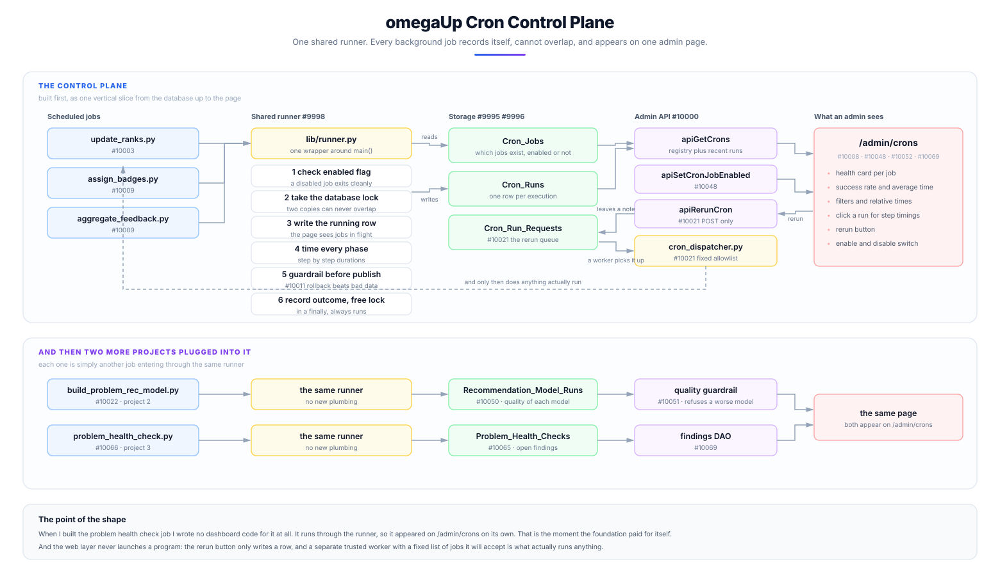
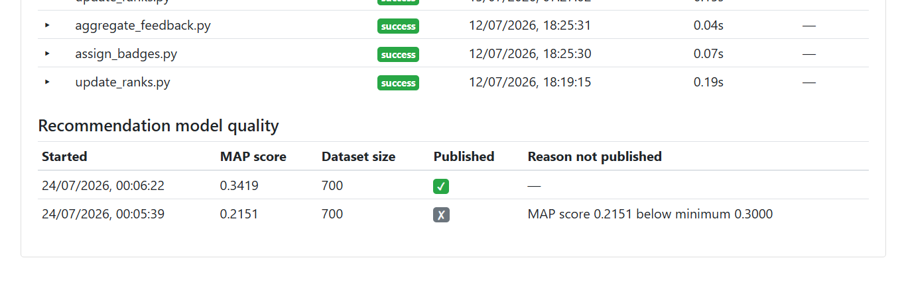
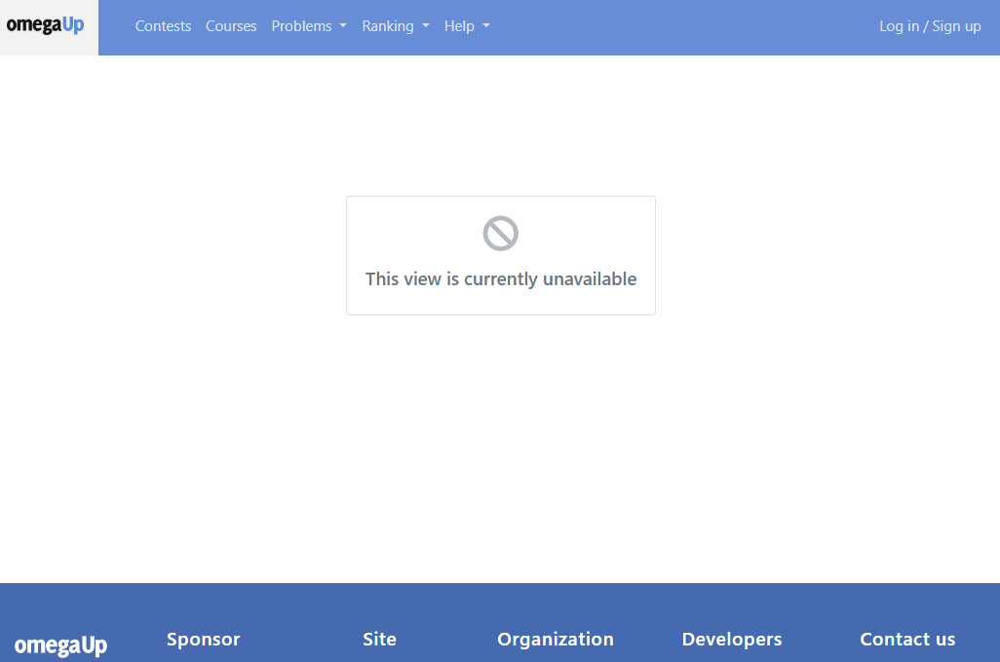
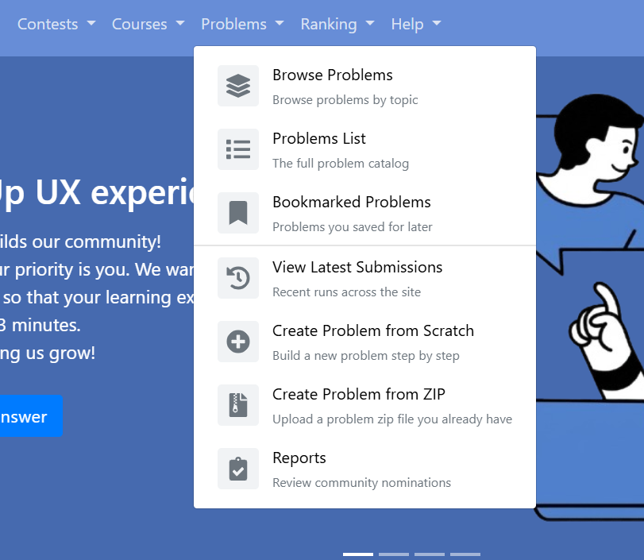
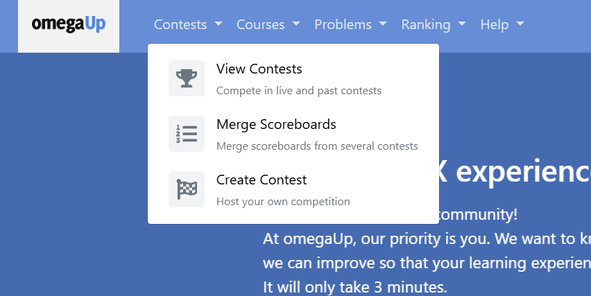

# Google Summer of Code 2026: Cronjob Optimization for omegaUp

**Contributor:** [Prasanna Mishra](https://github.com/PrasannaMishra001)
**Organisation:** [omegaUp](https://omegaup.com)
**Mentors:** [Juan Pablo](https://github.com/pabo99), [Ankit](https://github.com/Ankitsinghsisodya)
**Project size:** Large, 350 hours
**Coding period:** 26 May 2026 to 24 August 2026

## About Me

I am a third year Integrated B.Tech and M.Tech student in Information Technology at IIITM Gwalior. I have been contributing to omegaUp since August 2025, nine months before this project started, and by the time the coding period began I had around twenty merged changes on the platform including GitHub sign in, human readable contest dates, and the system settings table and its data access layer. That matters mostly because it meant I did not spend the first month of the summer finding my way around the codebase.

## Project Motivation

omegaUp runs a handful of Python scripts on a schedule. They recompute the rankings, hand out badges, aggregate the feedback students leave on problems, and train the model that suggests what to solve next. In production only three of them are actually scheduled, and the order they run in is enforced by nothing more than the gap on the clock between them.

The problem is that nobody was watching any of it. There was no record that a job had run at all, so if last night's ranking job died halfway through, the first sign would be a student noticing days later that their solved problem had never counted. Nothing stopped two copies of the same job running at once either, which matters because the ranking job used to delete every row of the rankings table and write fresh ones. Two copies overlapping could leave half a leaderboard, and nothing raises an error when that happens. It quietly produces wrong data and carries on. On top of that, an admin who wanted to rerun a job needed shell access to a production pod.

While reading omegaUp's production deployment repository I found a commit from December 2021 saying "Make update-ranks only run once a day for now". The "for now" had been holding for five years. In the same afternoon I found that the recommendation model is never trained in production at all, because that job was never added to the schedule.

## Project Goals

My original proposal was narrow. It was about cleaning up four Python scripts: five specific SQL problems, the near total absence of unit tests, fourteen bare except blocks, some magic numbers, badge atomicity, and a string replacement involving NOW(). Two of those four scripts had zero Python unit tests between them.

At the midterm I passed, and the feedback was that the work so far did not add up to one thing you could point at. It was many small improvements spread thinly across existing scripts, and what was wanted was something vertical: a single project cutting through the database, the backend, the jobs, the interface and the tests, where the result is a feature somebody can actually see.

Rather than choose the next project alone, I read the production deployment repository so I would be arguing from facts, wrote up fourteen candidate projects, and sent them to my mentor saying I was not attached to any of them and would rather know what the organisation needed. Juan Pablo chose one and named the two that should follow it:

> the highest priority is building a Cron Control Plane. Today our cron infrastructure lacks visibility and operational tooling. After that, automated problem health checks and scheduled training for the recommendation model.

So the second half became three projects sharing one foundation.

## Technical Implementation

### Architecture



### How the shared runner works

Every job now wraps its `main()` in one small helper:

```python
with lib.runner.run(parser.prog, args) as cron_run:
    with cron_run.phase('update_users_stats'):
        update_users_stats(...)
    cron_run.set_rows_affected(rows)
```

1. **Check the enabled flag.** If the registry says this job is switched off, it exits cleanly and records nothing.
2. **Take a database lock.** Two copies of the same job can never run at once.
3. **Write a running row.** So the admin page can see a job that is currently in flight, not only finished ones.
4. **Time every phase.** Each step inside the job is recorded separately.
5. **Run the guardrail.** On the ranking job, the freshly computed ranking is checked before it is published.
6. **Record the outcome and free the lock.** In a finally block, so it always happens.

The lock lives in the database rather than on disk because these jobs can run on different machines, so a lock file on one machine means nothing to a job on another. It also solves the failure I was most worried about: the database ties the lock to the connection, so if a job dies while holding it, the lock releases by itself. A crash cannot jam the door shut forever.

### Project 1: the Cron Control Plane

Twelve pull requests, built as a stack where each one depends on the one below it. Two tables store the registry of jobs and the history of every run. A shared runner puts every job into that history and stops them overlapping. An admin page at `/admin/crons` shows job health, run durations, per step timings and error output. A rerun button lets an admin re run a job without server access.

The rerun button is the piece I thought hardest about. The obvious version is that the button sends a request and the server runs the job. I deliberately did not do that, because the moment a web page can cause a program to run on your servers you have built a door, and doors get picked. Instead the button writes down a request, and a separate trusted worker already running on the inside picks that row up and runs the job, and only jobs on a fixed list it knows about. The web page never runs anything. It leaves a note. Two things fall out of that for free: every rerun is recorded, and the person pressing the button needs no server access, which was the entire point.

The ranking job also gets a guardrail. If the newly computed ranking is empty, has negative scores, or has lost more than half the previously ranked users, it raises and the transaction rolls back. I would rather have yesterday's rankings than today's broken ones. I proved it rather than asserting it: on a forced failure the job exits non zero and the checksum of the rankings table is identical before and after, which is what "the rollback left the data untouched" actually means.

<video controls preload="metadata" style="max-width:100%; height:auto;">
  <source src="https://github.com/user-attachments/assets/45588e28-e2d1-4c36-960f-100feff002f5" type="video/mp4">
  <a href="https://github.com/omegaup/omegaup/pull/10048">Watch the dashboard walkthrough</a>
</video>

### Project 2: scheduled recommendation model training

omegaUp has a model that answers "this student just solved problem X, what should they try next". It was an on demand script. Nobody was on the hook for running it, there was no record of what past training produced, and a bad run would silently overwrite the good model file serving real students.

Every run now records how good the model it produced was, using a MAP score. That is a number between zero and one measuring how often the problem the model suggested next turned out to be one the student actually solved, weighted so a good suggestion near the top of the list counts for more. A guardrail applies two rules before the model file is written: an absolute floor, and a regression bar against the last published model. The floor alone only catches disasters, because a model that squeaks over the bar while being clearly worse than the one it replaces would sail straight through.



Above, the guardrail working: one model published at 0.3419, and one refused at 0.2151 with the reason recorded rather than hidden.

### Project 3: automated problem health checks

A problem on omegaUp can stop working after it is published, and nothing errors loudly. Students just hit a wall, and the only signal was somebody filing a report, which means the platform found out about broken problems from the people it had already failed. A nightly job now looks for four things.

| Check | Severity | What it means |
|---|---|---|
| `judge_errors` | error | Five or more recent submissions to one problem came back as a judge or validator error. Students are submitting correct code and getting a system failure. To the student it looks like their fault. |
| `no_languages` | error | A public problem with no submission languages enabled. Listed, browsable, and impossible to submit to. |
| `never_solved` | warning | Public, twenty or more submissions, zero accepted. Either the test data is wrong or the statement is misleading. |
| `deprecated_public` | warning | Retired, but still visible to students. |

Findings are upserted against a unique key, so each one keeps the date it was first detected. That is the difference between "this is broken" and "this has been broken for three weeks". A finding that stops appearing is marked resolved rather than deleted.

This job needed no dashboard code of its own. It runs through the shared runner, so it appeared on `/admin/crons` automatically. That is the moment the foundation paid for itself.

## Development Journey

Thirty one pull requests between 26 May and 3 August, each with an issue written before it. Seventeen of my pull requests merged during the coding period.

The control plane pull requests are stacked, each built on the one before it, so GitHub's diff for a later one still carries its unmerged predecessors. Each shrinks to just its own change once the one below it merges.

### Pull requests

| Component | Description | Status | PR |
|---|---|---|---|
| **Cron control plane** | add cron control plane tables | merged | [#9995](https://github.com/omegaup/omegaup/pull/9995) |
|  | add cron control plane dao | merged | [#9996](https://github.com/omegaup/omegaup/pull/9996) |
|  | add cron runner library | open | [#9998](https://github.com/omegaup/omegaup/pull/9998) |
|  | add cron admin api | merged | [#10000](https://github.com/omegaup/omegaup/pull/10000) |
|  | record update ranks runs | open | [#10003](https://github.com/omegaup/omegaup/pull/10003) |
|  | add cron admin dashboard | open | [#10008](https://github.com/omegaup/omegaup/pull/10008) |
|  | record badges and feedback runs | open | [#10009](https://github.com/omegaup/omegaup/pull/10009) |
|  | add ranking audit guardrail | open | [#10011](https://github.com/omegaup/omegaup/pull/10011) |
|  | add cron rerun | open | [#10021](https://github.com/omegaup/omegaup/pull/10021) |
|  | record remaining cron runs | open | [#10022](https://github.com/omegaup/omegaup/pull/10022) |
|  | add cron dashboard e2e | open | [#10023](https://github.com/omegaup/omegaup/pull/10023) |
|  | improve cron dashboard with health cards filters and auto refresh | open | [#10048](https://github.com/omegaup/omegaup/pull/10048) |
| **Cron tests, queries and reliability** | feat(cron): add unit test infrastructure and aggregate_feedback/utils tests | open | [#9883](https://github.com/omegaup/omegaup/pull/9883) |
|  | feat(cron): add update_ranks unit tests | open | [#9889](https://github.com/omegaup/omegaup/pull/9889) |
|  | fix(cron): parameterize coder_of_the_month queries | merged | [#9900](https://github.com/omegaup/omegaup/pull/9900) |
|  | fix(cron): replace bare except clauses with typed except | merged | [#9901](https://github.com/omegaup/omegaup/pull/9901) |
|  | fix(cron): merge user rank with upsert instead of full reinsert | merged | [#9903](https://github.com/omegaup/omegaup/pull/9903) |
|  | add structured phase logging to crons | open | [#9914](https://github.com/omegaup/omegaup/pull/9914) |
|  | feat(cron): add assign_badges unit tests | open | [#9920](https://github.com/omegaup/omegaup/pull/9920) |
|  | refactor(cron): name acl/role magic numbers with constants | merged | [#9940](https://github.com/omegaup/omegaup/pull/9940) |
| **Recommendation model training** | add recommendation model runs table | open | [#10050](https://github.com/omegaup/omegaup/pull/10050) |
|  | record and guard recommendation training | open | [#10051](https://github.com/omegaup/omegaup/pull/10051) |
|  | add recommendation model dao and dashboard | open | [#10052](https://github.com/omegaup/omegaup/pull/10052) |
| **Problem health checks** | add problem health checks table | merged | [#10065](https://github.com/omegaup/omegaup/pull/10065) |
|  | add problem health check cron | open | [#10066](https://github.com/omegaup/omegaup/pull/10066) |
|  | show problem health findings for admins | open | [#10069](https://github.com/omegaup/omegaup/pull/10069) |
| **Alongside the main project** | Extract NavbarItem component for help menu | merged | [#9871](https://github.com/omegaup/omegaup/pull/9871) |
|  | add view unavailable component | merged | [#9919](https://github.com/omegaup/omegaup/pull/9919) |
|  | extend navbar item style to remaining submenus | closed | [#9967](https://github.com/omegaup/omegaup/pull/9967) |
|  | build navbar menus from a single configuration | merged | [#9968](https://github.com/omegaup/omegaup/pull/9968) |
|  | make view unavailable entrypoint generic | merged | [#10025](https://github.com/omegaup/omegaup/pull/10025) |

### Issues

| Issue | Title | Status |
|---|---|---|
| [#9868](https://github.com/omegaup/omegaup/issues/9868) | As a developer, I want a reusable NavbarItem component so that submenu entries are easier to maintain | closed |
| [#9869](https://github.com/omegaup/omegaup/issues/9869) | As a contributor, I want editable fields in the feature request form so that I can fill in the As a / I want / so that prompts directly | closed |
| [#9870](https://github.com/omegaup/omegaup/issues/9870) | Refactor navbar help submenu into a reusable NavbarItem component | closed |
| [#9882](https://github.com/omegaup/omegaup/issues/9882) | Add unit test infrastructure for cron scripts | open |
| [#9888](https://github.com/omegaup/omegaup/issues/9888) | Add unit tests for update_ranks.py ranking logic | open |
| [#9890](https://github.com/omegaup/omegaup/issues/9890) | Add unit tests for assign_badges.py | open |
| [#9897](https://github.com/omegaup/omegaup/issues/9897) | Add a generic "View unavailable" component | closed |
| [#9899](https://github.com/omegaup/omegaup/issues/9899) | Parameterize string-built queries in coder_of_the_month.py | closed |
| [#9902](https://github.com/omegaup/omegaup/issues/9902) | Avoid full delete and reinsert of User_Rank in update_ranks | closed |
| [#9904](https://github.com/omegaup/omegaup/issues/9904) | Prevent and merge duplicate school profiles | open |
| [#9913](https://github.com/omegaup/omegaup/issues/9913) | Emit structured per-phase logs from cron scripts | open |
| [#9939](https://github.com/omegaup/omegaup/issues/9939) | Replace acl_id/role_id magic numbers in cron scripts with named constants | closed |
| [#9962](https://github.com/omegaup/omegaup/issues/9962) | Extend the navbar item style with icons and descriptions to remaining submenus | open |
| [#9966](https://github.com/omegaup/omegaup/issues/9966) | Build the navbar menus from a single configuration with visibility rules | closed |
| [#9992](https://github.com/omegaup/omegaup/issues/9992) | Cron Control Plane : an observability and operational tooling for background jobs (parent issue) | open |
| [#9993](https://github.com/omegaup/omegaup/issues/9993) | persistant cron execution history by registry and run tables | closed |
| [#9994](https://github.com/omegaup/omegaup/issues/9994) | DAOs for the cron tables | closed |
| [#9997](https://github.com/omegaup/omegaup/issues/9997) | Reusable cron runner that records runs and prevents overlap | open |
| [#9999](https://github.com/omegaup/omegaup/issues/9999) | Admin API for cron run history and health | closed |
| [#10002](https://github.com/omegaup/omegaup/issues/10002) | Record update_ranks executions through the runner | open |
| [#10004](https://github.com/omegaup/omegaup/issues/10004) | Admin dashboard page for cron jobs | open |
| [#10007](https://github.com/omegaup/omegaup/issues/10007) | Record assign_badges and aggregate_feedback through the runner | open |
| [#10010](https://github.com/omegaup/omegaup/issues/10010) | Pre-publish guardrail for the ranking job | open |
| [#10017](https://github.com/omegaup/omegaup/issues/10017) | Make the view unavailable entrypoint generic and driven by the payload | closed |
| [#10018](https://github.com/omegaup/omegaup/issues/10018) | Let admins safely rerun a cron job | open |
| [#10019](https://github.com/omegaup/omegaup/issues/10019) | Record the remaining crons through the runner | open |
| [#10020](https://github.com/omegaup/omegaup/issues/10020) | End to end test for the cron dashboard | open |
| [#10047](https://github.com/omegaup/omegaup/issues/10047) | Improve the cron dashboard with health cards, filters, relative times and auto refresh | open |
| [#10049](https://github.com/omegaup/omegaup/issues/10049) | Make the recommendation model training scheduled, recorded and guarded (parent issue) | open |
| [#10064](https://github.com/omegaup/omegaup/issues/10064) | Detect problems that silently stopped working (parent issue) | open |

## Work Outside the Main Project

Two other pieces ran alongside the cron project and both are merged.

The first was a generic way to tell somebody that part of the site is switched off, in [#9919](https://github.com/omegaup/omegaup/pull/9919). The easy version would have been to write that message into the one page that needed it. I built a component the whole platform can use instead, in every language the site supports. Juan Pablo then pointed out that the way I had wired it in would mean copying a file every time another view needed disabling, so [#10025](https://github.com/omegaup/omegaup/pull/10025) made the entry point generic and driven by the page payload.



The second was rebuilding the navigation menus from a single configuration, in [#9968](https://github.com/omegaup/omegaup/pull/9968), building on [#9871](https://github.com/omegaup/omegaup/pull/9871) and [#9801](https://github.com/omegaup/omegaup/pull/9801). The menus had been hand written markup repeated per menu, so I extracted a reusable item with an icon, a title and a description, then rebuilt every menu from one configuration file with per entry visibility rules.

The clearest illustration of what a review is for is the pair below. First I shipped entries reading "Create zip file" and "I have a zip file", which make sense only if you already know what they do. Juan Pablo asked for something more descriptive, and the second image is the result.






## What Went Wrong

The hardest thing I did was withdraw a promise from my own funded proposal. I had committed to rebuilding the rankings in a second table and swapping it in with a rename. When I researched it properly I found five problems. A rename is a schema change, so it forces a commit and destroys the single transaction the phase depends on. Copying a table does not bring its foreign key constraints with it, and constraint names are unique per database, so the swapped table either loses three of them or needs an awkward alternating naming scheme. It needs privileges the production database user may not have. It changes what the coder of the month calculation sees while it runs. And it still rewrites every row every day, so the write load is not reduced, only moved.

Then I found the part that settled it. The problem the swap was meant to solve had already been fixed by somebody else while I was writing the proposal. The phase had become a single transaction, so readers already see the complete old ranking the whole way through, and the empty leaderboard scenario I had written against no longer existed. I replaced it with an upsert that stays inside the transaction, needs no special privileges, and follows a pattern already used further down the same file.

A different kind of problem arrived after the tables merged, when one required check insisted a generated schema file be byte for byte identical to the main schema, and another required check crashed trying to read that same file. Both were mandatory, so satisfying one broke the other. The crash was at one specific table, caused by a full text index clause another contributor had added that the schema parser did not understand. Nobody had hit it because main's copy of the generated file was out of date and did not contain that line yet, so mine was the first change to regenerate it. The fix was one line in the parser. When two automated checks contradict each other, the contradiction is usually pointing at something real.

The bug I am most glad about only appeared because I wrote the test. In the health checks, the step that closes findings which are no longer detected was reading the clock after writing the new ones rather than before. On a slow run, a finding written moments earlier could be judged as not seen this run and closed immediately, so the job would report a problem as fixed at the instant it discovered it. The fix was to take one timestamp at the start and use it throughout. The bug was in code I had written minutes earlier and was certain was correct.

Almost worse is something I nearly shipped without noticing. Three of the four health checks fired on the first real run and the judge errors one found nothing. My first reaction was relief. That was wrong. It found nothing because the development database contained no runs with that kind of error at all, so the check had never been exercised even once. I seeded the failure case and watched it fire before I was willing to trust it. No results and not working look identical from the outside.

There was also a cost I underestimated. Keeping pull requests small and ordered is right for reviewers and expensive for me. Every time something merges I rebase the next one so its diff stands alone, and when the tables merged the migration number changed, so every later database change had to shift too. At one point a change to a shared file had to be propagated across seventeen branches because all of them descended from it.

The hardest part had nothing to do with code. At the midterm, not one of my cron project pull requests had been merged. All had green checks and all were waiting, and there was nothing I could write to change that. My mentors were straightforward that review bandwidth was the constraint and told me to keep building. The first landed on 3 July and sixteen more have landed since.

## Current Status

The whole foundation is on main: the registry and history tables, the data access layer, the admin API, the problem health checks table, the ranking upsert, the SQL parameterisation, the typed exception handling and the acl and role constants.

[#9998](https://github.com/omegaup/omegaup/pull/9998), the shared runner, is approved and waiting to be merged. It is the keystone, with four more pull requests sitting directly behind it. [#9883](https://github.com/omegaup/omegaup/pull/9883), [#9889](https://github.com/omegaup/omegaup/pull/9889), [#9920](https://github.com/omegaup/omegaup/pull/9920), [#9914](https://github.com/omegaup/omegaup/pull/9914), [#10003](https://github.com/omegaup/omegaup/pull/10003) and [#10008](https://github.com/omegaup/omegaup/pull/10008) are all mergeable with passing checks. Eleven more are open as drafts, kept that way on purpose so they surface one at a time as the pull request below each of them merges, and every one has been verified end to end in Docker.

What sets the pace now is review time rather than code. That is a real constraint on a volunteer maintained project rather than a complaint. Nothing is half built and nothing is blocked on me.

## Future Work

The gap I care most about is missed run detection. The system can tell you a job failed, but not that a job never started, which is the one failure mode run history structurally cannot catch. The schedule is already stored in the registry, so the pieces are there. After that, failure alerting, reusing the notification path the rerun dispatcher already uses, which is the piece that turns history into monitoring. Then retention, because nothing deletes from the run history, which is fine today and will not be in two years.

Smaller things: pagination past the fifty run cap, a duration sparkline per job, and a next scheduled run column computed from the schedule already stored. I also deliberately left model versioning and rollback alone, because the model file layout and the serving side live in omegaUp's production repository and building it blind risked doing it wrong.

## Acknowledgments

Thanks to [Juan Pablo](https://github.com/pabo99) for reviews that were specific and for pushing back on the parts that deserved it. The question about storing a name instead of an id made the schema better, and the request to split a large pull request changed how I work rather than just how I structured that one change.

Thanks to [Ankit](https://github.com/Ankitsinghsisodya) for the review of my test infrastructure that found real bugs in it, including a fetchone that never advanced and so returned the first row forever. Being told early and precisely that my fake database was subtly wrong was worth more than any approval.

And thanks to omegaUp for letting a contributor propose a direction, argue for it with evidence, and then build it.

---

[All my pull requests](https://github.com/omegaup/omegaup/pulls?q=is%3Apr+author%3APrasannaMishra001) · [All my issues](https://github.com/omegaup/omegaup/issues?q=is%3Aissue+author%3APrasannaMishra001) · [The epic](https://github.com/omegaup/omegaup/issues/9992) · [Progress tracker](https://github.com/omegaup/omegaup/discussions/9972)
